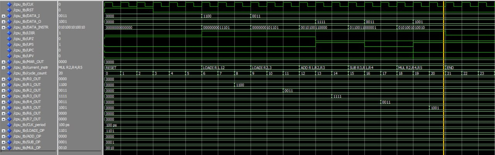

# SIMPLE 4BIT CPU

## Overview

This project implements a simple CPU in VHDL, designed to execute a basic instruction set. The CPU features a 4-bit data path, an 8-register file (R0–R7), and supports arithmetic, logical, and memory operations. The architecture includes:

- **Control Unit:** Manages the CPU's operation using a finite state machine (FETCH, DECODE, EXECUTE).
- **ALU:** Performs operations like addition, subtraction, multiplication, logical operations (AND, OR, XOR, NAND), shifts, and load/store.
- **Register File:** Stores 4-bit values in 8 registers, with two read ports and one write port.
- **CPU Top-Level:** Integrates the control unit, ALU, and register file, handling instruction execution and data flow.

## Instruction Set

The CPU uses a 13-bit instruction format:

- **Bits 12–10:** ASEL (source register A)
- **Bits 9–7:** BSEL (source register B)
- **Bits 6–4:** DSEL (destination register)
- **Bits 3–0:** FSEL (operation code)

Supported operations include:

- **Arithmetic:** ADD (0000), SUB (0001), MUL (0010), INC (1001), DEC (1010)
- **Logical:** AND (0011), OR (0100), XOR (0101), NAND (0110)
- **Shifts:** SHL (0111), SHR (1000)
- **Memory:** LOAD (1011), STORE (1100), LOADI (1101)
- **NOP:** (1111)

## Testbench

The testbench (cpu_tb.vhd) simulates the following sequence:

- **LOADI R1, 12:** Loads 12 (binary: 1100) into R1.
- **LOADI R2, 3:** Loads 3 (binary: 0011) into R2.
- **ADD R1, R2, R3:** Adds R1 + R2 (12 + 3 = 15, binary: 1111) and stores in R3.
- **SUB R3, R1, R4:** Subtracts R3 - R1 (15 - 12 = 3, binary: 0011) and stores in R4.
- **MUL R2, R4, R5:** Multiplies R2 * R4 (3 * 3 = 9, binary: 1001) and stores in R5.

## Simulation Waveform

The waveform below shows the simulation results for the testbench sequence. Key signals include:

- Clock (CLK), Reset (RST), and Instruction Register load (LDIR).
- Input instruction (DATA_INSTR) and data (DATA_I).
- Register outputs (R0_OUT to R7_OUT).
- ALU flags (UPZ, UPS, UPC, UPV).
- Current instruction (current_instr) and cycle count (cycle_count).

## Files

- **control_unit.vhd:** Control unit implementation.
- **alu.vhd:** Arithmetic Logic Unit implementation.
- **register_file.vhd:** Register file implementation.
- **cpu.vhd:** Top-level CPU integration.
- **cpu_tb.vhd:** Testbench for simulation.

## Usage

To simulate the CPU:

- Compile all VHDL files in a VHDL simulator (e.g., ModelSim, GHDL).
- Run the testbench (cpu_tb).
- Observe the waveform to verify the CPU's behavior.

## Notes

- The clock period in the testbench is set to 100 ps.
- Each instruction takes 3 clock cycles (FETCH, DECODE, EXECUTE).
- The ALU handles overflow and sets appropriate flags (Zero, Sign, Carry, Overflow).
